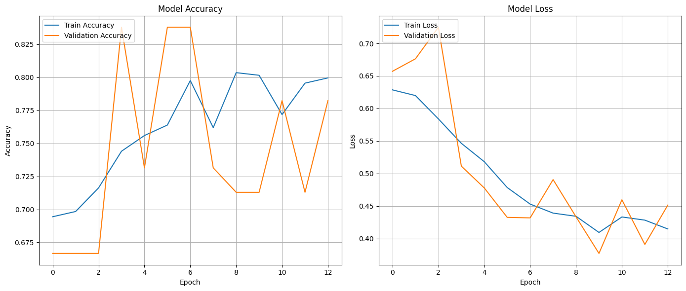
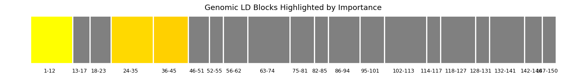
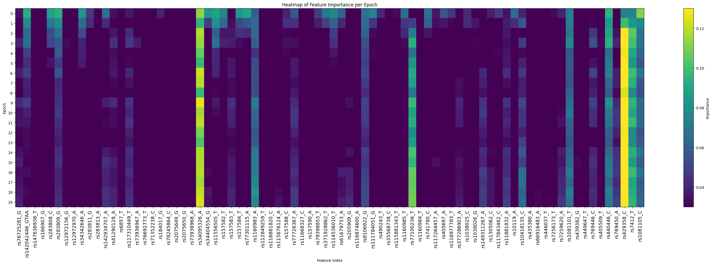
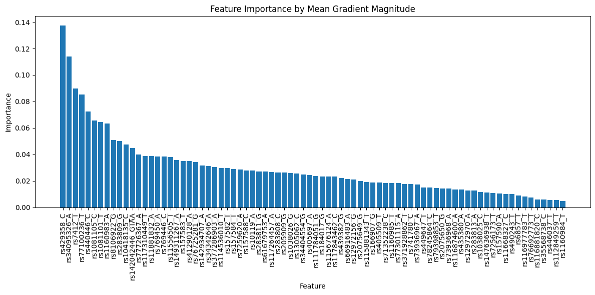

# Deep-Block 
(Beta Version for Preliminary Experiments): Genetic Variant Analysis for Alzheimer's Disease

## Overview

Deep-Block is a software tool designed to analyze whole-genome sequencing (WGS) data for identifying genetic variants associated with Alzheimer's disease (AD). It integrates advanced AI-driven genomics techniques with transformer models to capture long-range dependencies in genomic data, providing insights into the genetic basis of AD.

## Key Features

- **Transformer-Based Algorithms:** Deep-Block utilizes transformer-based algorithms specifically optimized for analyzing WGS data. These algorithms employ a novel tokenization strategy based on Linkage Disequilibrium (LD) blocks to effectively capture the genetic architecture.
  
- **Identification of Genetic Variants:** By considering the natural correlations between Single Nucleotide Polymorphisms (SNPs) within LD blocks, Deep-Block can accurately identify genetic variants linked to AD. The self-attention mechanism of the transformer model helps uncover relationships between distant genomic regions, potentially discovering novel genomic loci associated with AD.

- **Handling Missing Data:** Deep-Block incorporates various machine learning-based imputation methods to address missing data in genomic research. These methods, including Simple Imputer, GAN Imputer, K-NN Imputers, Iterative Imputer, and MissForest Imputer, demonstrate stable and statistically robust performance, enhancing the accuracy of the analysis.

## Results

Deep-Block successfully identified key LD blocks and SNPs associated with Alzheimer's disease (AD):

### Figure: Results of Deep-Block

Results of Deep-Block in identifying key LD blocks and SNPs associated with AD are summarized as follows:

- **Training Graph:** The transformer's training graph illustrates the optimization process during model training.
  
- **Importance of LD Blocks:** LD blocks play a crucial role in capturing the genetic architecture of AD. This visualization highlights the significance of LD blocks in the analysis.
  
- **Identification of Significant SNPs:** Deep-Block identifies significant SNPs within LD blocks. Notably, rs429358 emerged as the most important SNP, confirming known results and revealing new insights.
  
  

## License

© Taeho Jo, Ph.D.
Department of Radiology and Imaging Sciences
Indiana University School of Medicine
